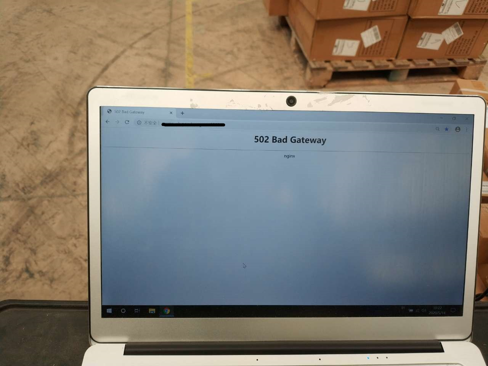
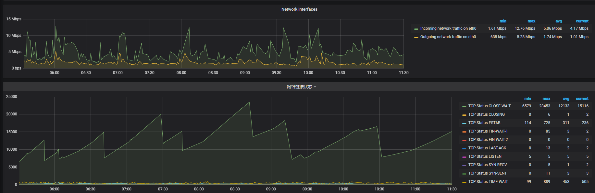
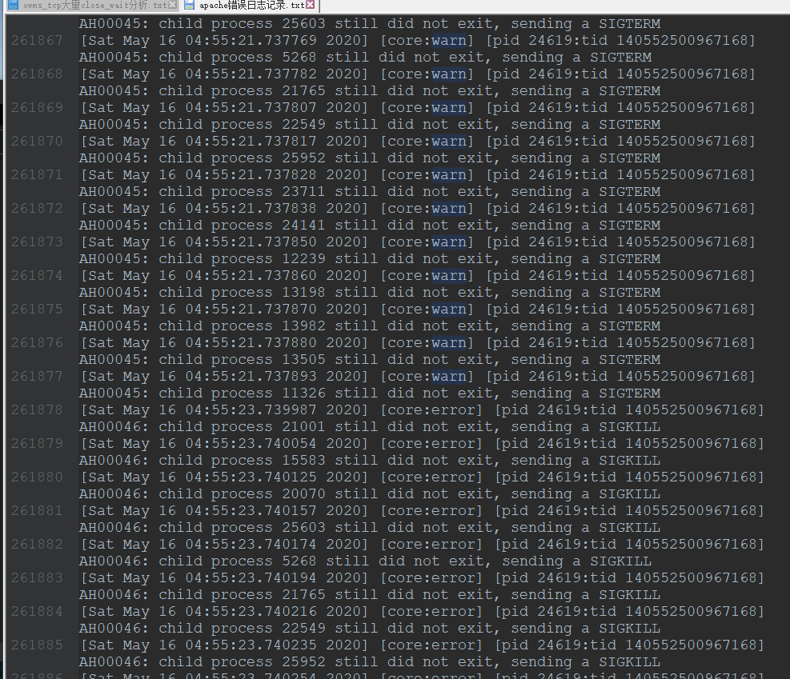
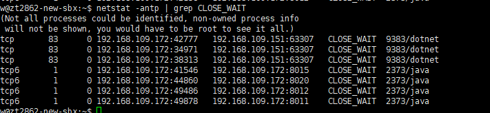

现有的系统架构基于nginx 网管反向代理 +  web服务器使用apache + php + mysql 阿里云RDS

现有方案考虑更换成 nginx 网管反向代理 + web服务器 nginx + php-fpm +php + mysql  阿里云RDS

PHP 7.0版本 apache 2.4版本

## 问题

1. 发布代码可能导致系统出现502
2. owms,hms请求wms服务器,会出现大量的CLOSE_WAIT状态的tcp请求,请求量大的情况下,会导致连接池占满,无法处理请求,服务器出现502
3. 请求owms服务器,有概率出现502
4. apache存在错误,进程异常退出,php模块异常,内存泄漏等问题
5. 大量的CLOSE_WAIT一定时应用程序出现问题,如果是java或者.net语言的应用可以考虑是否socks未正常关闭导致的问题

问题1 - 发布出现502

 

问题2 - 大量请求502  - grafana 分析web服务器的性能日志大量CLOSE_WAIT tcp进程,占用链接池



问题3 - 请求随机502 - kibana分析apache访问日志,随机502


问题4 -  apache错误日志



## 解决方案

1 停用apache,使用php-fpm替换

2 PHP程序使用的curl,有close,排查应用问题,可能时apache底层问题或者PHP插件问题

理由,FPM更稳定,支持更大的请求

## 临时的解决方案

1. 设置MaxRequestWorkers =1000 这个只是延迟了事故发生,如果服务器再次耗尽内存,问题依旧会发生
2. 如果请求量不多,可以切换apache的工作模式,看能否解决,修改apache工作模式 切换到 prefork  
3. http请求的头部设置 ''Connection'  => 'close'

## 查看服务器当前TCP CLOSE_WAIT状态的进程

```
netstat -antp | grep CLOSE_WAIT
```

随机端口的服务器为客户端,另一个服务器为服务端



## 使用tcpdump命令导出请求日志

```
tcpdump  -w   /path/log.cap
```

导出文件后,可以下载软件wireshark分析tcp请求日志

## tcp进程池满了apache错误日志

```
[Sat May 16 04:16:51.913919 2020] [mpm_event:error] [pid 24619:tid 140552500967168] AH03490: scoreboard is full, not at MaxRequestWorkers.Increase ServerLimit.
```

因为CLOSE_WAIT太多,导致tcp进程池满了,服务端无法再服务


## CLOSE_WAIT故障分析

客户端发起的挥手请求,服务端返回确认后,进入CLOST_WAIT但是应用关闭失败,第三次挥手请求没有发送出去导致进程停留在CLOST_WAIT状态,客户端TCP停留在FIN-WAIT-2状态,因为 Linux 有一个「tcp_fin_timeout」设置,控制了 FIN_WAIT2 的最大生命周期.所以客户端不会出现阻塞情况

## TCP三次握手


*握手请求发起方一定是客户端*

## TCP四次挥手


*挥手请求可以是客户端发起也可以是服务端发起*

*客户端请求头部设置''Connection'  => 'close' 后,也会主动发起挥手,但是服务端不一定会确认,也可以再次发起挥手到客户端*

## TCP通信数据包分析

- 114:12:45.104687  时间带有精确到微妙
- localhost.39870 > localhost.9502 表示通信的流向，39870是客户端的随机接口，9502是服务器端,固定端口
- [S] 表示这是一个SYN请求
- [S.] 表示这是一个SYN+ACK确认包: 
- [.] 表示这是一个ACT确认包， (client)SYN->(server)SYN->(client)ACT 就是3次握手过程
- [P] 表示这个是一个数据推送，可以是从服务器端向客户端推送，也可以从客户端向服务器端推
- [F] 表示这是一个FIN包，是关闭连接操作，client/server都有可能发起
- [R] 表示这是一个RST包，与F包作用相同，但RST表示连接关闭时，仍然有数据未被处理。可以理解为是强制切断
- win 4099 是指滑动窗口大小
- length 18指数据包的大小

1 客户端49492 服务端60081
客户端发起请求 第一次握手 [S]  SYN = 1, seq = 2396311514

```
13:34:18.895072 IP 10.10.10.10.49492 > 10.10.10.159.600: Flags [S], seq 2396311514, win 29200, options [mss 1460,sackOK,TS val 429550635 ecr 0,nop,wscale 7], length 0
```

2 服务端确认 第二次握手  [S.]  SYN=1,ACK=1, ack = 2396311514+1 ,seq = 2480093606, 
```
13:34:19.042847 IP 10.10.10.159.600 > 10.10.10.10.49492: Flags [S.], seq 2480093606, ack 2396311515, win 28960, options [mss 1460,sackOK,TS val 500389019 ecr 429550635,nop,wscale 7], length 0
```

3 客户端确认 第三次握手 [.] ACK=1, ack=1 | 客户端收到了服务端的SYN+ACK包,向服务端发送确认包ACK(ack=2480093606+1)
```
13:34:19.042858 IP 10.10.10.10.49492 > 10.10.10.159.600: Flags [.], ack 1, win 229, options [nop,nop,TS val 429550672 ecr 500389019], length 0
```
客户端和服务端进入 ESTABLISHED 状态,进行数据的双向通信

4 客户端发送数据包 [P.] 702字节长度的数据 
```
13:34:19.042888 IP 10.10.10.10.49492 > 10.10.10.159.600: Flags [P.], seq 1:703, ack 1, win 229, options [nop,nop,TS val 429550672 ecr 500389019], length 702
```

5 客户端再次发送数据包 [P.]  702字节长度的数据 
```
13:34:19.461644 IP 10.10.10.10.49492 > 10.10.10.159.600: Flags [P.], seq 1:703, ack 1, win 229, options [nop,nop,TS val 429550777 ecr 500389019], length 702
```

6 服务端确认收到数据 
```
13:34:19.609433 IP 10.10.10.159.600 > 10.10.10.10.49492: Flags [.], ack 703, win 238, options [nop,nop,TS val 500389161 ecr 429550777], length 0
```

7 服务端发送数据包 [P.] 1056字节长度的数据
```
13:34:19.625753 IP 10.10.10.159.600 > 10.10.10.10.49492: Flags [P.], seq 1:1057, ack 703, win 238, options [nop,nop,TS val 500389165 ecr 429550777], length 1056
```

8 客户端确认收到数据
```
13:34:19.625760 IP 10.10.10.10.49492 > 10.10.10.159.600: Flags [.], ack 1057, win 245, options [nop,nop,TS val 429550818 ecr 500389165], length 0
```

9  服务端再次发送数据 1056字节长度的数据
```
13:34:20.764275 IP 10.10.10.159.600 > 10.10.10.10.49492: Flags [P.], seq 1:1057, ack 703, win 238, options [nop,nop,TS val 500389450 ecr 429550777], length 1056
```
10 客户端表示收到数据
```
13:34:20.764281 IP 10.10.10.10.49492 > 10.10.10.159.600: Flags [.], ack 1057, win 245, options [nop,nop,TS val 429551102 ecr 500389450,nop,nop,sack 1 {1:1057}], length 0
```

以上是握手请求和数据传输的tcp包通信记录,接下来还有四次挥手记录,才能完成整个TCP请求

## CLOSE_WAIT TCP包通信请求分析  
三次握手请求完成:

```
13:28:14.661683 IP client.45068 > server: Flags [S], seq 2644197498, win 29200, options [mss 1460,sackOK,TS val 451059577 ecr 0,nop,wscale 7], length 0
13:28:14.809077 IP server > client.45068: Flags [S.], seq 1368176130, ack 2644197499, win 28960, options [mss 1460,sackOK,TS val 521897961 ecr 451059577,nop,wscale 7], length 0
13:28:14.809088 IP client.45068 > server: Flags [.], ack 1, win 229, options [nop,nop,TS val 451059613 ecr 521897961], length 0
```

开始传输数据:
```
13:28:14.809124 IP client.45068 > server: Flags [P.], seq 1:702, ack 1, win 229, options [nop,nop,TS val 451059613 ecr 521897961], length 701
13:28:14.956014 IP server > client.45068: Flags [.], ack 702, win 238, options [nop,nop,TS val 521897998 ecr 451059613], length 0

13:28:14.966435 IP server > client.45068: Flags [P.], seq 1:591, ack 702, win 238, options [nop,nop,TS val 521898000 ecr 451059613], length 590
13:28:14.966439 IP client.45068 > server: Flags [.], ack 591, win 238, options [nop,nop,TS val 451059653 ecr 521898000], length 0
```

开始释放请求
第一挥手

```
13:29:19.963379 IP server > client.45068: Flags [F.], seq 591, ack 702, win 238, options [nop,nop,TS val 521914250 ecr 451059653], length 0
```
第二次挥手
```
13:29:20.001642 IP client.45068 > server: Flags [.], ack 592, win 238, options [nop,nop,TS val 451075912 ecr 521914250], length 0
```

这个通信记录中,服务端发起挥手请求时进入CLOSE_WAIT状态,等待关闭,这个时候无法关闭应用,进程挂起 


## xmind思维导图附件下载

 [TCP网络请求.xmind](../static/xmind/TCP网络请求.xmind) 