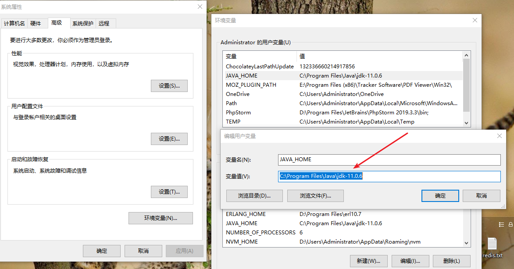
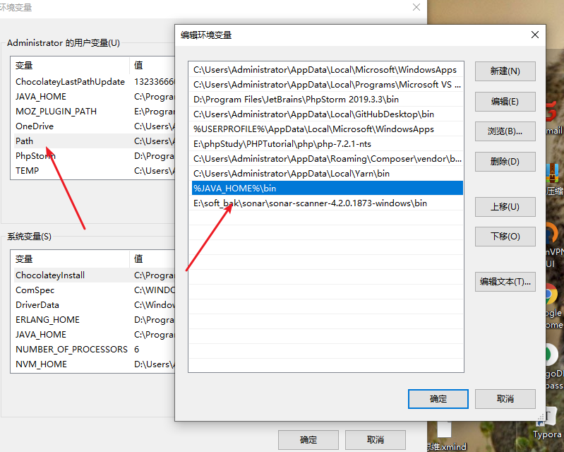
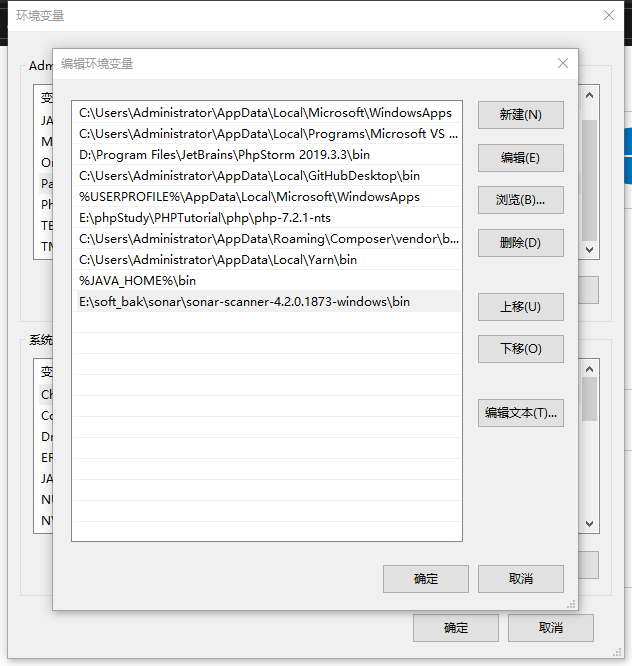

使用工具扫描代码可以更快的提高代码质量

## 0 下载

- [下载sonarqube](https://www.sonarqube.org/downloads/)

- [下载Java](https://www.oracle.com/java/technologies/oracle-java-archive-downloads.html)

- [下载sonar-scanner](https://docs.sonarqube.org/latest/analysis/scan/sonarscanner/)

  

## 1 安装服务端 sonarqube

- 安装java jdk [官网下载](https://www.oracle.com/java/technologies/javase-downloads.html)
- 配置到path

JAVA_HOME 

JDK 安装目录,例如 C:\Program Files\Java\jdk-11.0.6 

Paht 添加 %JAVA_HOME%\bin

配置完成后可以重启电脑

验证: cmd 可以执行 java 或 javac 命令

## 2 启动sonarquber

1. 解压下载好的sonarqube包
2. 进入  \bin\windows-x86-64
3. 运行StartSonar.bat  （保留窗口打开，不能关闭）
4. 访问 localhost:9000 如果访问不了，可在\conf\sonar.properties打开端 sonar.web.port=9000 修改端口
5. 初始帐号密码：admin ,可以访问sonarqube后台创建项目

## 3 安装客户端sonar-scanner

1. 配置到path  解压sonar-scanner,配置bin目录到path,重启
2. 登录sonarqube后台
3. 创建项目
4. 复制key,需要存储起来,复制命令

## 4 扫描代码

1. 进入代码根目录
2. 执行命令

 [window10使用sonarqube扫描代码.xmind](../static/xmind/window10使用sonarqube扫描代码.xmind) 